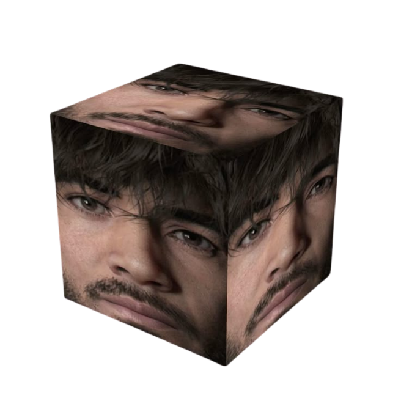
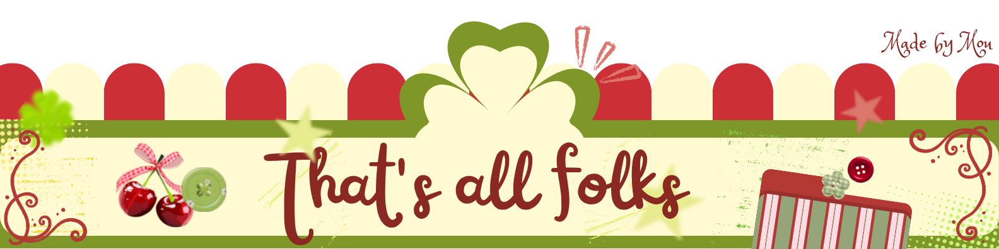

  

 

<table align="center" width="100%">

<tr>
<td align="center">

༘⋆

ᯓ‎𝄞 ˎˊ˗

</td>
</tr>

<tr>
<td>

## Hey there! I'm Mutia Rahmah ૮꒰◞ ˕ ◟ ྀི꒱ა

**Informatics Student (3rd semester) | Mulawarman University | Design Enthusiast**

Currently exploring programming while chasing my passion for design. I work mostly with C++ and Python on the tech side, and Figma, CorelDRAW, and Photoshop on the creative side. I enjoy building things that work well and look good.

 

</td>
</tr>

<tr>
<td>

## 🐸 Tech Stack:࿔*:･

</td>
</tr>

<tr>
<td>

## 🍏 Tools, Design & Collab•.°⋆:

</td>
</tr>

<tr>
<td>

## 🍀🌸. ݁⋆ ۶ৎ ݁˖ . ݁

</td>
</tr>

</table>

  

